<p align="center">
  
</p>

<h1 align="center">Just a Corporate Goose</h1>

Just a Corporate Goose is a local-first Windows desktop planner with daily
planning, focus timers, reminders, task tracking, hydration goals, and
gamification.

## Interface examples

The screenshots below use generic sample tasks. Personal task names, meeting
titles, account details, and local configuration have been removed.

### Main dashboard

<p align="center">
  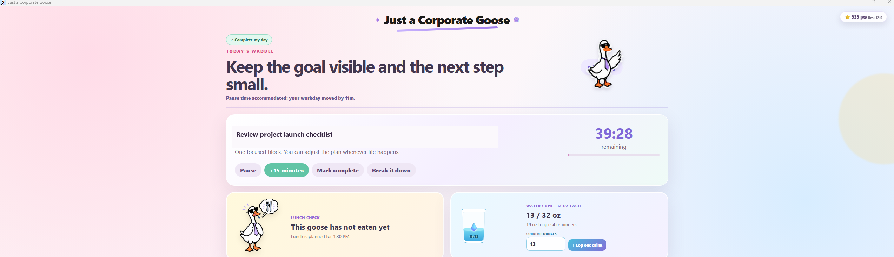
</p>

### Always-on-top focus timer

<p align="center">
  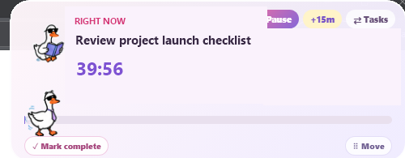
</p>

## Privacy

Application state and private configuration stay on the local machine. They are
not stored in this repository.

- Daily state is stored in Electron's `dailygoose` user-data directory.
- On the first launch, the app asks for a preferred name and the Azure DevOps
  organization, project, repository, and account email used by the PR-review
  connector.
- After setup is submitted, the app automatically creates
  `%APPDATA%\dailygoose\local-config.json`.
- The setup screen does not appear again while that file contains
  `"setupComplete": true`.
- Authentication remains with the locally installed applications and command
  line tools. The app does not store access tokens or passwords.
- Generated builds, dependencies, profiles, environment files, certificates,
  credentials, and local configuration are excluded by `.gitignore`.

`local-config.example.json` documents the optional local settings without
containing real account or organization information. Manual editing is not
required because the first-run setup screen creates the real local file.

## Local connector prerequisites

- Outlook calendar access uses the signed-in Outlook desktop application.
- Azure DevOps PR review access uses the signed-in Azure CLI session.
- The first-run form collects identifiers only. It never requests a password,
  access token, authentication cookie, client secret, or certificate.

## Development

```powershell
npm install
npm run dev
```

## Validation

```powershell
npm run build
npm run lint
```

## Package for Windows

```powershell
npm run dist
```

Generated installers and unpacked applications are written to `release\` and
must not be committed.

## Brand reference and layout

These are the original reference screenshots for the brand and layout direction,
including the full board composition, light-blue background, and the overall
visual structure.

<p align="center">
  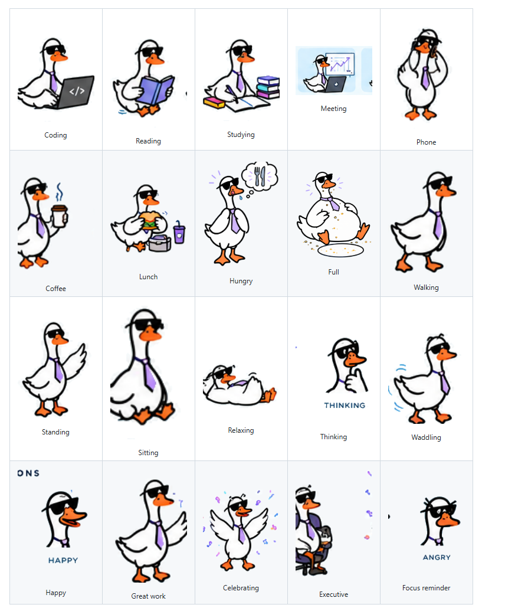
</p>

## Goose brand artwork

The app changes the goose artwork to match the current activity, reminder, or
celebration.

<table>
  <tr>
    <td align="center"><br /><sub>Coding</sub></td>
    <td align="center"><br /><sub>Reading</sub></td>
    <td align="center"><br /><sub>Studying</sub></td>
    <td align="center"><br /><sub>Meeting</sub></td>
    <td align="center"><br /><sub>Phone</sub></td>
  </tr>
  <tr>
    <td align="center">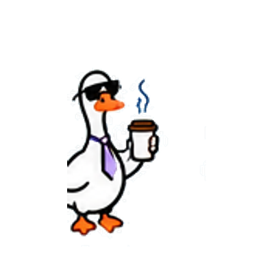<br /><sub>Coffee</sub></td>
    <td align="center">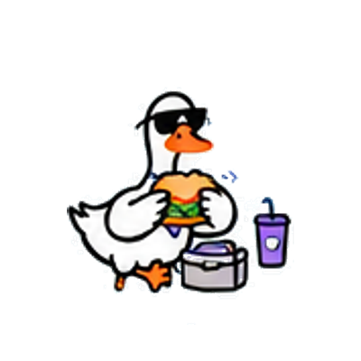<br /><sub>Lunch</sub></td>
    <td align="center">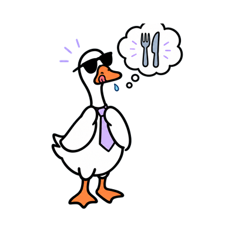<br /><sub>Hungry</sub></td>
    <td align="center">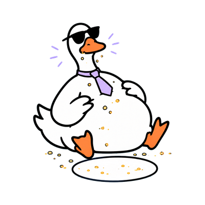<br /><sub>Full</sub></td>
    <td align="center">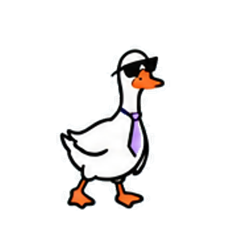<br /><sub>Walking</sub></td>
  </tr>
  <tr>
    <td align="center">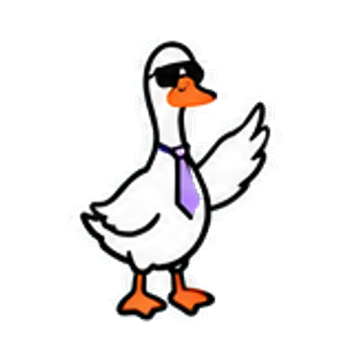<br /><sub>Standing</sub></td>
    <td align="center"><br /><sub>Sitting</sub></td>
    <td align="center"><br /><sub>Relaxing</sub></td>
    <td align="center">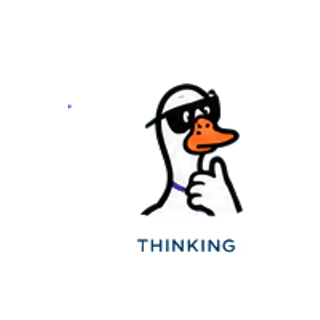<br /><sub>Thinking</sub></td>
    <td align="center">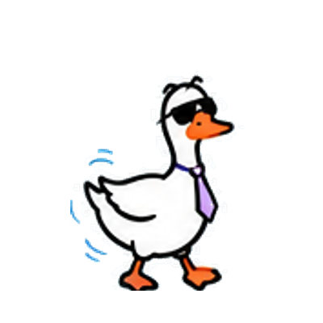<br /><sub>Waddling</sub></td>
  </tr>
  <tr>
    <td align="center"><br /><sub>Happy</sub></td>
    <td align="center">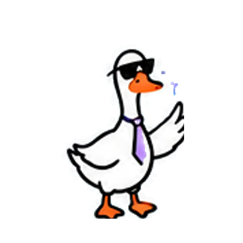<br /><sub>Great work</sub></td>
    <td align="center"><br /><sub>Celebrating</sub></td>
    <td align="center">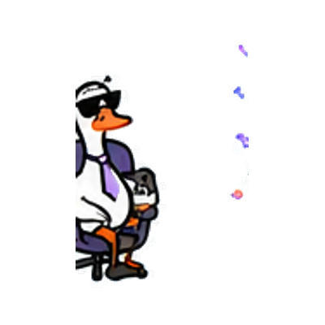<br /><sub>Executive</sub></td>
    <td align="center">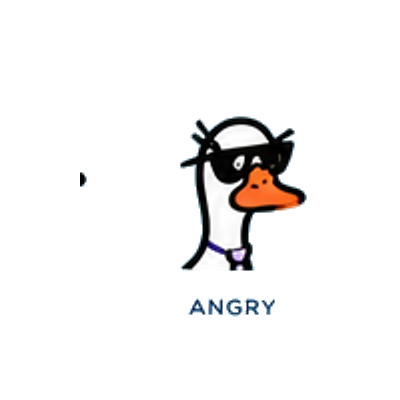<br /><sub>Focus reminder</sub></td>
  </tr>
</table>
